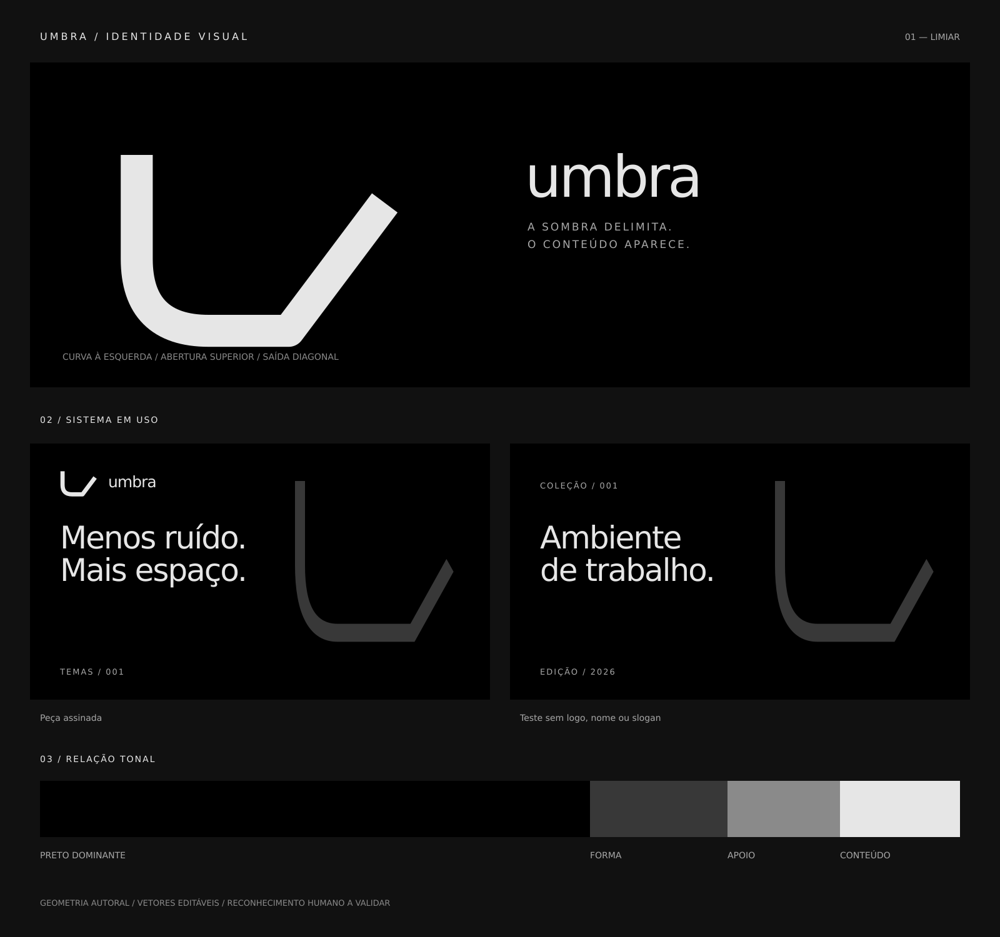

# Umbra — limiar

Reconstrução de 2026-09-05, orientada pela skill `memorable-visual-identity`.

O símbolo é um limiar aberto: desce à esquerda, percorre uma curva inferior, segue por uma base curta e sai em diagonal à direita. Ele representa a passagem entre sombra e conteúdo sem tentar desenhar letras. O conceito de coruja e os monogramas anteriores foram retirados.

Revisão 0.5.0: o limiar, antes asset secundário, passa a ser o símbolo principal. O traço tem 16 unidades; a curva é a única transição arredondada e a saída diagonal permanece aberta. A forma é um percurso único, sem ramificações.

## Arquivos

- [Símbolo claro transparente](logo/umbra-symbol.svg)
- [Símbolo preto transparente](logo/umbra-symbol-black.svg)
- [Avatar quadrado](logo/umbra-avatar.svg)
- [Prancha do sistema](system.svg)
- [Provas de reprodução](stress.svg)
- [Wallpaper 3840 × 2160 sem marca](applications/wallpaper.svg)
- [Peça com nome substituído](applications/competitor-swap.svg)
- [Guia principal](../../DESIGN.md)
- [Avaliação e protocolo de reconhecimento](REVIEW.md)

Os originais são SVGs editáveis, sem imagens raster embutidas ou recursos remotos. A geometria do símbolo não depende de fontes. As pranchas usam DejaVu Sans, com fallback sans-serif; a fonte não é distribuída. Os PNGs em `exports/` são derivados dos vetores.

Reprodução: largura mínima recomendada de 32 px para o símbolo; margem livre de 16 unidades além do desenho, cuja caixa externa tem aproximadamente 124 × 88 unidades. Para avatares, usar o arquivo dedicado com folga para recorte circular. Preto sobre claro; Bone sobre preto. Não espelhar, fechar a abertura, recortar ou aplicar efeitos.

Construção autoral assistida por Codex. Não há nova licença de distribuição estabelecida por este diretório. A nova direção está implementada; associação espontânea à marca ainda não foi medida.

---

Umbra no GitHub: https://github.com/eduardoaugustolb/umbra
