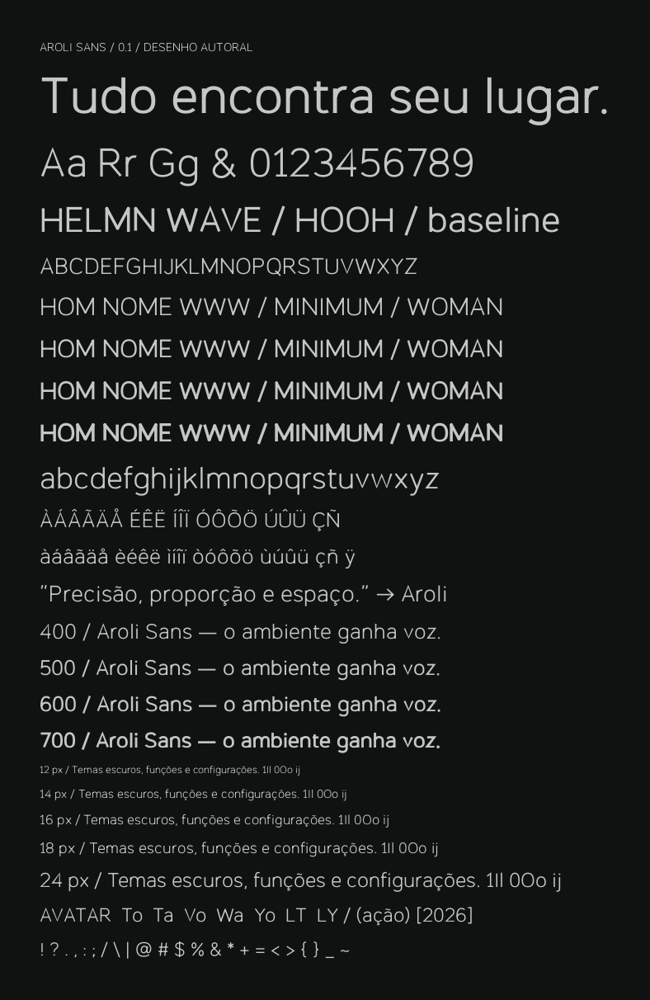

# Aroli Sans

Família proporcional autoral de comunicação da Aroli. Companheira da Aroli Mono, substitui Switzer no site e nas assinaturas. Nome deliberadamente direto: Aroli identifica a família; Sans e Mono indicam a função.

## Direção

Uma sans de baixo contraste, com proporções próximas do território visual da Switzer, construída com desenhos próprios. Curvas levemente ovais, `a` de dois andares, `g` de um andar, ombros suaves e aberturas amplas. O espaço interno traduz o intervalo do Encaixe sem aplicar recortes decorativos em cada letra. Títulos em caixa normal e tracking moderado; a voz continua discreta nos textos de interface.

Regular 400, Medium 500, SemiBold 600 e Bold 700 são arquivos reais em OTF e WOFF2. Não é uma fonte variável. Cada peso contém 167 glifos, incluindo ASCII, acentos portugueses precompostos, pontuação editorial, setas e ©. GPOS inclui pares de kerning e suas variantes acentuadas.

## Construir

Na raiz do repositório, com Bun, fonttools com Brotli e Pango instalados:

```sh
cd fonts/aroli && bun install --frozen-lockfile
cd ../..
bun fonts/aroli-sans/build.ts
bun fonts/aroli-sans/verify.ts
bun fonts/aroli-sans/proof.ts
cd web && bun run setup:fonts
cd .. && bun branding/aroli/build.ts
```

O gerador reutiliza a dependência opentype.js já instalada no módulo Mono; não lê contornos de nenhuma fonte externa. As curvas cúbicas autorais são amostradas e expandidas em contornos fechados. `fonttools` adiciona GPOS e comprime WOFF2. Os binários em `dist/` são versionados: builds do site apenas os copiam, sem ferramentas tipográficas ou download de fontes.



A prova usa os OTFs finais em Pango/HarfBuzz com Fontconfig isolado. Inclui acentos, pontuação, kerning e tamanhos de 12–60 px. Abrir e inspecionar após reconstruir.

## Estado e autoria

Versão 0.1, protótipo aplicado no projeto. Desenhos e código novos, sem modificar ou renomear Switzer. A licença proprietária da raiz rege esses arquivos; não inclui ícones ou contornos de terceiros. A licença histórica da Switzer é preservada em `branding/aroli/` como registro da versão anterior.

Ainda não há itálico, hinting manual, eixo variável, cobertura latina completa ou posicionamento de acentos combinantes. Use texto em NFC. A semelhança pretendida é de categoria e proporção, não equivalência métrica. A geração matemática dos pesos ainda pede refinamento óptico profissional; a prova interna não substitui testes com leitores e em aparelhos físicos. Não afirmar reconhecimento exclusivo ou aprovação tipográfica final.
