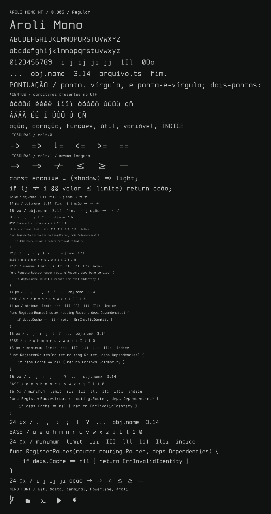
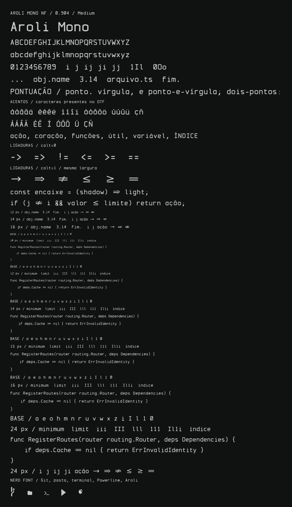

# Aroli Mono NF

Fonte autoral monoespaçada para programação, com três pesos e foco em leitura de código em 14–16 px. O alfabeto latino básico, algarismos, pontuação, símbolo do Encaixe e ligaduras são desenhados em [`build.ts`](build.ts). A construção combina segmentos retos e curvas discretas, largura fixa e a marca Encaixe em U+100000. Aroli Sans é a fonte proporcional de comunicação.

Os ícones vêm de **Symbols Nerd Font** e mantêm seus pontos de código. São um conjunto externo à autoria dos caracteres de texto. A fonte gera um único OTF com ambos; `dist/NERD-FONTS-LICENSE.txt` acompanha a compilação. Os nomes e o desenho do texto Aroli não são derivados de JetBrains Mono, Fira Code ou outra fonte de texto.

## Construção

Use `AROLI_NERD_SYMBOLS` e `AROLI_NERD_LICENSE` para caminhos personalizados.

Requisitos: Bun, `opentype.js` (instalado pelo Bun), `fonttools`, `pango-view`, Fontconfig e o arquivo `SymbolsNerdFont-Regular.ttf`. O script procura este último em `/usr/share/fonts/TTF/` ou no caminho indicado por `AROLI_NERD_SYMBOLS`. A etapa FontTools usa Python com as versões fixadas em `requirements-build.txt`; `AROLI_FONT_PYTHON` seleciona esse interpretador. Bun continua sendo o ponto de entrada do build.

```sh
cd fonts/aroli
bun install
bun run build:all
```

Saída: [`dist/AroliMonoNF-Regular.otf`](dist/AroliMonoNF-Regular.otf). Há também pesos de leitura para interfaces: [`Medium`](dist/AroliMonoNF-Medium.otf) e [`SemiBold`](dist/AroliMonoNF-SemiBold.otf), gerados pelo mesmo desenho com contorno mais robusto. O arquivo `dist/*-base.otf` é intermediário. Ative *contextual alternates* (`calt`) no editor para `->`, `=>`, `!=`, `<=`, `>=` e `==`. O símbolo Aroli fica em U+100000. Veja também o [espécime SVG](dist/specimen.svg).

As provas abaixo são geradas pelo próprio build (`proof.ts`, Pango/HarfBuzz sobre o OTF final) e atualizadas a cada `bun run build:all`.





## Qualidade e validação — 0.902

A prova visual é produzida para cada peso com Pango/HarfBuzz a partir do respectivo OTF final, em um ambiente Fontconfig isolado sem fontes de fallback. Inclui os 37 caracteres acentuados, comparação `calt=0`/`calt=1`, distinção `i/I/l/1`, ícones e código em 10, 12, 14, 15, 16 e 24 px. É obrigatório abrir e inspecionar os PNGs após alterações; a geração do arquivo por si só não constitui aprovação visual.

- Cobertura textual: ASCII 32–126 e 37 letras acentuadas comuns em português e idiomas próximos. Regular (400), Medium (500) e SemiBold (600); itálico e cobertura latina ampliada ainda não estão disponíveis.
- Contornos textuais unidos antes do hinting CFF, com zonas de alinhamento e hastes verificadas no arquivo final. Os contornos dos ícones externos são preservados.
- `i` com base ampla e margens equilibradas; `I` com barras simétricas; `l` com entrada superior e pé próprio. Altura das minúsculas de 520 unidades em uma célula de 600.
- Bordas inferiores dos caracteres sem descendentes alinhadas em y=0 na construção, sem escala por glifo; ápices diagonais com overshoot óptico de até 5 unidades dentro do fuzz de hinting. Base em [-17,1] e altura-x em [1064,1082] verificadas no OTF final.
- As ligaduras preservam a largura total da sequência. Seu suporte visual depende do editor/terminal.
- Os ícones Nerd Font preservam os códigos do conjunto instalado. A cobertura exata depende da versão desse arquivo.
- A versão 0.9 prepara a fonte para uso como produto. A promoção para 1.0 exige validar no Zed em tela comum e HiDPI; provas Pango não substituem esse teste na IDE.

Esta fonte é opcional e não altera as configurações dos temas Aroli existentes. O guia de marca em [`../../DESIGN.md`](../../DESIGN.md) continua a orientar forma e legibilidade.

## Licenciamento

O código e os desenhos textuais Aroli são proprietários, com distribuição reservada a Eduardo Augusto, conforme [`LICENSE.txt`](LICENSE.txt). Não há concessão de licença pública aos componentes autorais. Os ícones pertencem aos respectivos autores do Nerd Fonts e mantêm suas próprias licenças: as restrições autorais Aroli não se aplicam a esses componentes. O build inclui os dois avisos no diretório de saída e o aviso de licença nos metadados do OTF.
