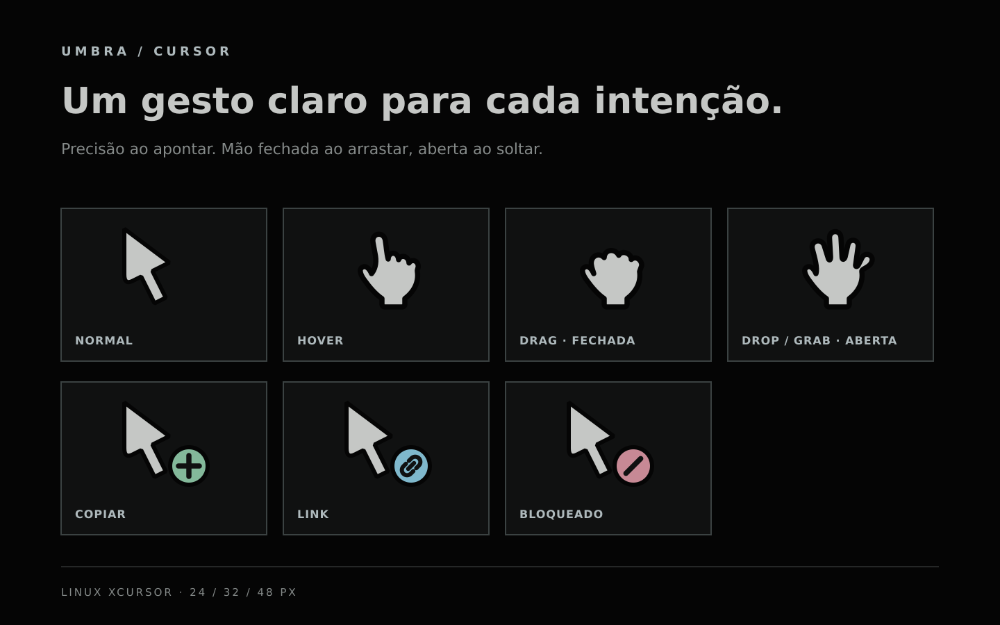

# Umbra Cursor



Pack de cursores para Linux. A seta é limpa e neutra, com preenchimento Bone e
contorno Charcoal. A seta adapta o limiar de `DESIGN.md`: descida vertical,
curva inferior à esquerda e saída diagonal à direita, com encontros chanfrados.
As mãos usam palma alta, polegar curto, punho simples e dedos articulados.
A leitura depende da silhueta, sem marcas internas ou dentes no punho.
Ao arrastar, a mão fica fechada; o estado `grab` usa a mão aberta.
Copiar, criar link e operação proibida usam selos específicos.
Os desenhos são autorais — não são assets do macOS.

Os selos compartilham centro `(36, 35)`, raio de 9 px e contorno de 2 px.
Os símbolos ficam inscritos em um raio de 6,25 px (incluindo seus traços),
preservando 1,75 px até a borda interna do círculo na grade de 48 px.
A cor identifica o estado; a geometria e o espaçamento permanecem constantes.

## Instalar

O [guia de instalação](docs/installation.md) cobre geração, GNOME, KDE Plasma,
Hyprland com e sem UWSM, Sway, XFCE/Cinnamon/MATE/X11, Flatpak e diagnóstico.

## Desenvolvimento

Leia [QUALITY.md](QUALITY.md) antes de alterar o tema: fonte de anatomia,
invariantes, regressões conhecidas, revisão visual e critérios de publicação.
As três mãos são geradas por `scripts/generate-hands.ts`; execute
`make -C themes/cursor/umbra hands` após alterar essa fonte.

`src/` contém os SVGs em uma grade de 48 px; `scripts/build-cursor` renderiza
24, 32 e 48 px e grava os arquivos binários em `cursors/`. Os PNGs temporários
ficam fora do repositório. Para apagar somente a saída gerada:

```sh
make -C themes/cursor/umbra clean
```

### Ver o preview

Revise primeiro a [prancha de silhuetas](silhouettes.svg), sem detalhes ou contorno.

Abra [preview.svg](preview.svg) no navegador ou no GitHub para ver a composição
com os sete estados do tema. Para regenerá-la após mexer nos desenhos:

```sh
bun themes/cursor/umbra/scripts/generate-preview.ts
```

Para reconstruir e verificar os binários:

```sh
make -C themes/cursor/umbra check
```

A verificação cobre os 21 frames (sete estados em três tamanhos): pontos de
clique, transparência pré-multiplicada, margens sem cortes, alinhamento da
seta entre estados e destinos dos aliases. A seta e seus estados com selos
compartilham o hotspot `(5, 4)`; o hover usa `(21, 8)`, junto à ponta do dedo.
As mãos aberta e fechada compartilham `(24, 24)`, evitando saltos entre elas.
As coordenadas são relativas à grade de 48 px e escaladas no build.

Para inspecionar os pixels dos binários sobre fundos claro e escuro, gere
uma folha de contato (cada pixel é exibido a 2×):

```sh
bun themes/cursor/umbra/scripts/verify-cursors.ts /tmp/umbra-cursors.svg
```

A GitHub Action **Cursor preview** executa o mesmo comando em pushes e pull
requests que afetam o pack. Ela falha se `preview.svg` não tiver sido atualizado
e disponibiliza o arquivo como artefato da execução.

## Estados

| Estado | Nome XCursor | Tratamento |
| --- | --- | --- |
| Normal | `default`, `left_ptr` | seta Bone com sombra/contorno carvão |
| Hover | `pointer`, `hand2` | mão clara e articulada |
| Arrastar | `grabbing`, `closedhand`, `move`, `dnd-move` | mão fechada |
| Soltar / disponível para arrastar | `grab`, `openhand` | mão aberta |
| Copiar | `copy`, `dnd-copy` | selo `+` sálvia |
| Link | `alias`, `dnd-link` | selo de elo azul |
| Bloqueado | `no-drop`, `not-allowed` | selo de barra rosa |

O tema herda os demais estados do Adwaita para preservar cursores que ainda
não receberam um desenho específico.

O aplicativo controla a troca de estado: a mão aberta após soltar aparece
quando ele solicita `grab` ou `openhand`. O tema não altera essa lógica.
