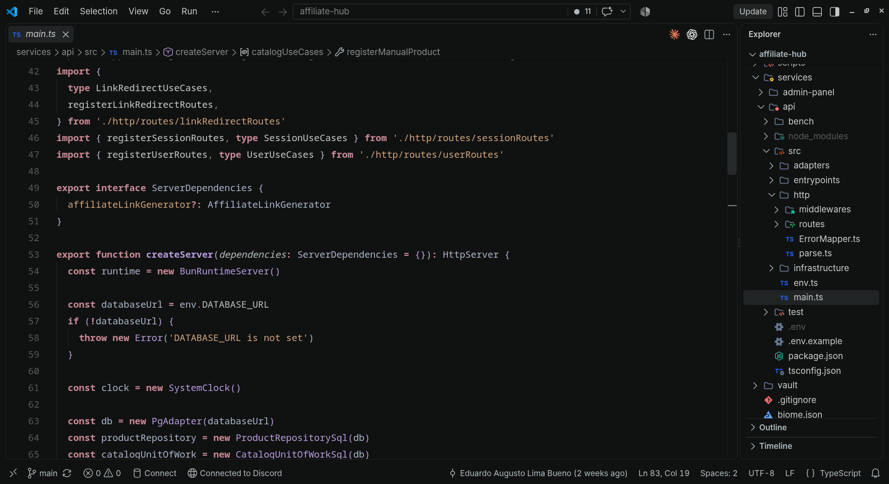

# Aroli para VS Code

Tema dark para o VS Code inspirado em ambientes noturnos de baixo brilho. Usa charcoal em vez de preto absoluto para separar editor, painéis e controles; a sintaxe recebe poucos acentos frios e pouco saturados — mesma linguagem do Aroli para Zed.

Duas variantes incluídas:

Os rótulos do seletor são Aroli Dark e Aroli Black. Os IDs de configuração continuam `Umbra` e `Umbra Ink`, respectivamente, para preservar `workbench.colorTheme` e personalizações já salvas. O identificador da extensão também permanece `DevEduardo.umbra-charcoal-theme`.

| Tema | Fundo do editor | Painéis |
| --- | --- | --- |
| `Aroli Dark` | Charcoal `#101111` | Charcoal `#101111` |
| `Aroli Black` | Ink `#050505` | Charcoal `#101111` |



## Paleta

| Função | Cor | Uso |
| --- | --- | --- |
| Charcoal | `#101111` | editor (Aroli), terminal e componentes de UI |
| Ink | `#050505` | editor e terminal na variante Ink |
| Graphite | `#191C1C` | hover, linha ativa e estados interativos |
| Divider | `#252727` | bordas e divisores |
| Ash | `#858A89` | texto secundário e comentários de documentação |
| Bone | `#C5C7C5` | texto principal |
| Mist | `#B4BEC0` | propriedades, membros e rótulos |
| Lilac | `#B79BDD` | funções, métodos e atributos |
| Rose | `#C78995` | keywords e operadores (bold) |
| Violet | `#9D7FD1` | variáveis especiais |
| Slate Blue | `#A9B4C8` | tipos, constantes, construtores e escapes |
| Amber | `#CDA27C` | strings e tags |
| Gold | `#D0B07C` | números e avisos |
| Sage | `#83B89A` | booleanos e sucesso |
| Sage Blue | `#9AB7B0` | foco, links e informação pontual |

A regra é conter, não eliminar, a cor: cerca de 85–90% da experiência permanece em cinzas escuros e neutros. Variáveis comuns continuam em Bone para evitar ruído.

## Instalação

### Identificador existente no Marketplace

A publicação desta migração é uma etapa externa ainda não executada. O Marketplace pode continuar exibindo Umbra até a atualização. O identificador estável é:

- [Extensão no Marketplace](https://marketplace.visualstudio.com/items?itemName=DevEduardo.umbra-charcoal-theme), ou:
- `Ctrl/Cmd+Shift+X`, busque `DevEduardo.umbra-charcoal-theme`, instale, depois `Ctrl-K Ctrl-T` e escolha `Aroli Dark` ou `Aroli Black`;
- ou via CLI:

```sh
code --install-extension DevEduardo.umbra-charcoal-theme
```

### Desenvolvimento local

#### Você precisa de

- VS Code 1.80 ou superior.
- Este repositório disponível localmente.

#### Instalar passo a passo

A partir da raiz do repositório, execute:

```sh
cp -r themes/vscode/aroli "$HOME/.vscode/extensions/DevEduardo.umbra-charcoal-theme-0.4.0"
```

Reinicie o VS Code, abra a paleta de comandos (`Ctrl-K Ctrl-T` / `Cmd-K Ctrl-T`) e escolha `Aroli Dark` ou `Aroli Black`.

Para o VS Code Insiders ou VSCodium, o diretório de extensões muda:

- Insiders: `$HOME/.vscode-insiders/extensions/DevEduardo.umbra-charcoal-theme-0.4.0`
- VSCodium: `$HOME/.vscode-oss/extensions/DevEduardo.umbra-charcoal-theme-0.4.0`

### Empacotar como .vsix (opcional)

Com Bun disponível:

```sh
cd themes/vscode/aroli
bunx --bun @vscode/vsce package --no-dependencies
code --install-extension umbra-charcoal-theme-0.4.0.vsix
```

### Atualizar

Repita o comando `cp -r` (ou reinstale o `.vsix`) sempre que baixar uma nova versão do tema e recarregue a janela (`Developer: Reload Window`).

### Remover

Remova somente a pasta instalada:

```sh
rm -rf "$HOME/.vscode/extensions/DevEduardo.umbra-charcoal-theme-0.4.0"
```

Isso não altera `settings.json` nem outras extensões. Se o tema ainda aparecer na lista, recarregue a janela.

## Compatibilidade

- formato: TextMate `tokenColors` + `semanticTokenColors` com `semanticHighlighting`;
- variantes: `Aroli Dark` (vs-dark) e `Aroli Black` (vs-dark);
- requer: VS Code `^1.80.0` (conforme `engines` do `package.json`);
- versão local preparada: `0.4.0` como `DevEduardo.umbra-charcoal-theme`;
- não inclui: fonte, ícones de arquivo/produto, ligaduras ou comportamento — o tema mexe só com cores.

## Limitações conhecidas

- `terminal.ansiBlack` acompanha o fundo do editor em cada variante; sobre fundos explícitos escuros ele pode sumir — comportamento herdado do mapeamento Zed;
- foco usa `#9AB7B0`; verificar contraste no seu monitor antes de considerar final.

---

Aroli no GitHub: https://github.com/eduardoaugustolb/umbra
